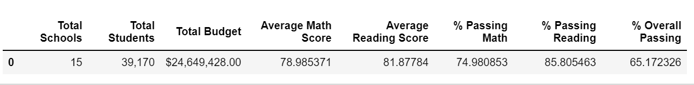
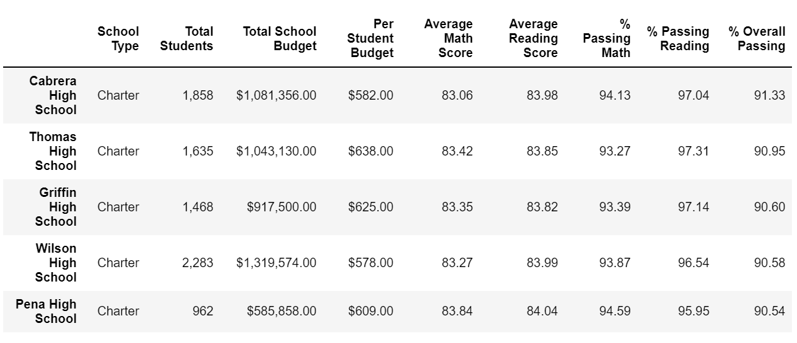
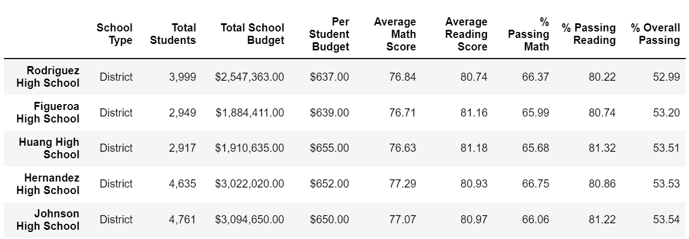
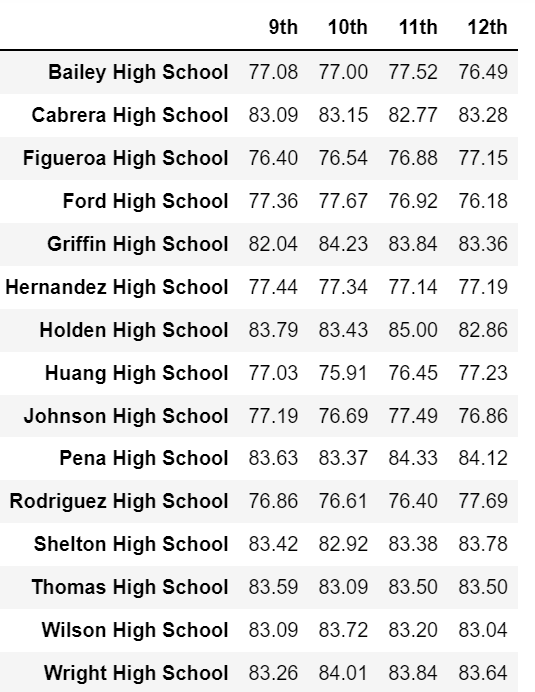
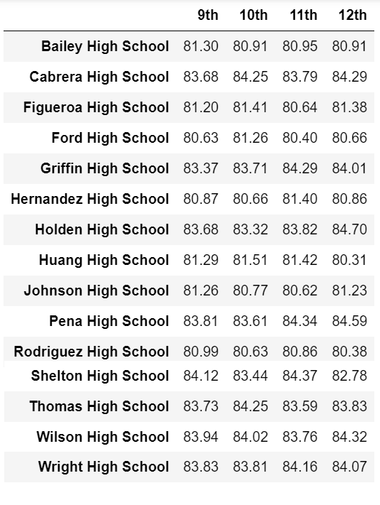
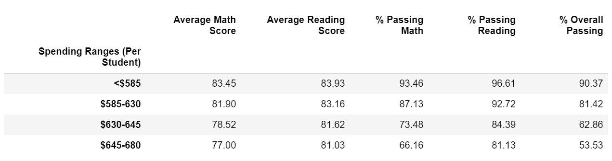
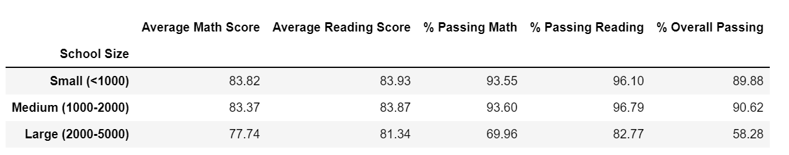
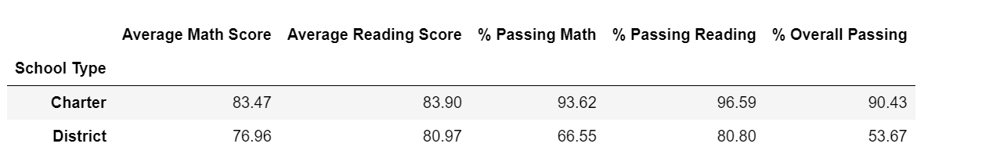

# pandas-challenge

In this assignment, Pandas DataFrames are created and manipulated to analyze school and standardized test data.

## Initial tasks performed

1. Created a new repository for this project called `pandas-challenge`. 

2. Cloned the new repository to my computer.

3. Inside my local Git repository, created a folder called `PyCitySchools`.

4. Added my Jupyter notebook to this folder. This will be the main script to run for analysis.

5. Pushed these changes to GitHub.

## Background

The first task is to analyze the district-wide standardized test results. The provided data contains every student's math and reading scores, as well as various information on the schools they attend. The requested task is to aggregate the data to showcase obvious trends in school performance.

## Files Used

- [School_Data](Resources/schools_complete.csv)
- [Students_Data](Resources/students_complete.csv)

## PyCitySchools Analysis

Using Pandas and Jupyter Notebook, created a report that includes the following data. The report also included a written description of at least two observable trends based on the data.

### Additional Trend Observed from Data

* All the schools in the district performed well in Reading compared to Math. District should provide more resources to schools to improve their student's Math performance. 
* The overall best performing school is 'Cabrera High School', a Charter School with overall passing rate of 91.33% and the Lowest performing high school is 'Rodriguez High School', a district school with overall passing rate of 52.99% only.

### District Summary

Created a high-level snapshot, in a DataFrame, of the district's key metrics, including the following:

* Total schools
* Total students
* Total budget
* Average math score
* Average reading score
* % passing math (the percentage of students who passed math)
* % passing reading (the percentage of students who passed reading)
* % overall passing (the percentage of students who passed math AND reading)

### School Summary

Created a DataFrame that summarizes key metrics about each school, including the following:

* School name
* School type
* Total students
* Total school budget
* Per student budget
* Average math score
* Average reading score
* % passing math (the percentage of students who passed math)
* % passing reading (the percentage of students who passed reading)
* % overall passing (the percentage of students who passed math AND reading)

### Highest-Performing Schools (by % Overall Passing)

Created a DataFrame that highlights the top 5 performing schools based on % Overall Passing. Include the following metrics:

* School name
* School type
* Total students
* Total school budget
* Per student budget
* Average math score
* Average reading score
* % passing math (the percentage of students who passed math)
* % passing reading (the percentage of students who passed reading)
* % overall passing (the percentage of students who passed math AND reading)

### Lowest-Performing Schools (by % Overall Passing)

Created a DataFrame that highlights the bottom 5 performing schools based on % Overall Passing. Include the following metrics:

* School name
* School type
* Total students
* Total school budget
* Per student budget
* Average math score
* Average reading score
* % passing math (the percentage of students who passed math)
* % passing reading (the percentage of students who passed reading)
* % overall passing (the percentage of students who passed math AND reading)

### Math Scores by Grade

Created a DataFrame that lists the average math score for students of each grade level (9th, 10th, 11th, 12th) at each school.

### Reading Scores by Grade

Created a DataFrame that lists the average reading score for students of each grade level (9th, 10th, 11th, 12th) at each school.

### Scores by School Spending

Created a table that breaks down school performance based on average spending ranges (per student). Created four bins with reasonable cutoff values to group school spending. Included the following metrics in the table:

* Average math score
* Average reading score
* % passing math (the percentage of students who passed math)
* % passing reading (the percentage of students who passed reading)
* % overall passing (the percentage of students who passed math AND reading)

### Scores by School Size

Created a table that breaks down school performance based on school size (small, medium, or large).

### Scores by School Type

Create a table that breaks down school performance based on type of school (district or charter).

